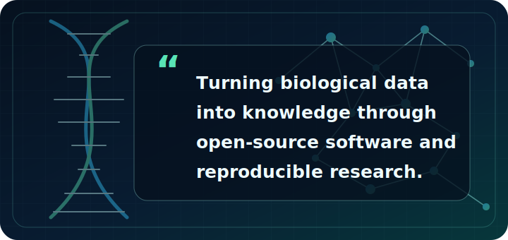
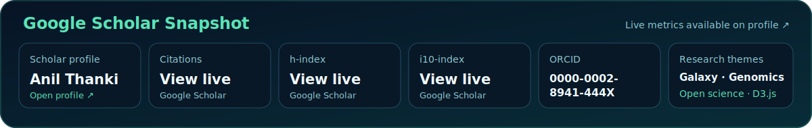

<table>
<tr>
<td width="58%" valign="middle">
<table>
<tr>
<td width="150" valign="middle">

</td>
<td valign="middle">
<h1>Anil Thanki</h1>
<h3>Senior Bioinformatician @ EMBL-EBI</h3>

<em>Building open-source tools for genomics, reproducible research, and scientific data visualisation.</em>

</td>
</tr>
</table>

</td>
<td width="42%" valign="middle">

</td>
</tr>
</table>

## 👋 About me

I’m a **Senior Bioinformatician at [EMBL-EBI](https://www.ebi.ac.uk/)**, building open and reproducible tools, workflows, and visualisations for large-scale sequencing data.

Previously, I worked as a Postdoctoral Research Scientist and Scientific Programmer at the [Earlham Institute](https://www.earlham.ac.uk/). I hold a PhD in Bioinformatics from the University of East Anglia, an MSc from the University of Leicester, and a BSc from Saurashtra University.

My work sits at the intersection of:

- 🧬 **Bioinformatics and genomics** — scalable analysis of sequencing and expression data
- 🔁 **Reproducible research** — Galaxy workflows, automation, containers, and open science
- 📊 **Scientific visualisation** — interactive tools that make complex biological data easier to explore
- 🤝 **Research software engineering** — maintainable tools built for scientific communities