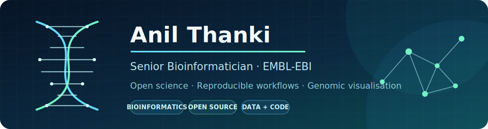

  

  
  
  
  
  

## 👋 About me

I’m a **Senior Bioinformatician at [EMBL-EBI](https://www.ebi.ac.uk/)**, building open and reproducible tools, workflows, and visualisations for large-scale sequencing data.

Previously, I worked as a Postdoctoral Research Scientist and Scientific Programmer at the [Earlham Institute](https://www.earlham.ac.uk/). I hold a PhD in Bioinformatics from the University of East Anglia, an MSc from the University of Leicester, and a BSc from Saurashtra University.

My work sits at the intersection of:

- 🧬 **Bioinformatics and genomics** — scalable analysis of sequencing and expression data
- 🔁 **Reproducible research** — Galaxy workflows, automation, containers, and open science
- 📊 **Scientific visualisation** — interactive tools that make complex biological data easier to explore
- 🤝 **Research software engineering** — maintainable tools built for scientific communities

## 🔬 Selected open-source work

| Project | What it does |
| --- | --- |
| **[TGAC Browser](https://github.com/EarlhamInst/TGACBrowser)** | An open-source genome browser designed for non-model organisms and custom genomic data tracks. |
| **[Aequatus](https://github.com/EarlhamInst/Aequatus)** | An interactive homology and synteny browser for exploring gene structures and comparative genomics. |
| **[GeneSeqToFamily](https://github.com/EarlhamInst/earlham-galaxytools/tree/119c5a7a43585697f0ce0ff3901a7cbc9fd5fcac/workflows/GeneSeqToFamily)** | A Galaxy workflow based on the Ensembl GeneTrees pipeline for identifying gene families and building gene trees. |
| **[ViCTree](https://github.com/anilthanki/ViCTree)** | An automated framework for taxonomic classification from protein sequences. |
| **[WigExplorer](https://github.com/anilthanki/biojs-vis-wigexplorer)** | A BioJS component for interactively exploring continuous genomic data in WIG format. |

  <a href="https://anilthanki.github.io/#projects"><strong>Explore more projects on my website →</strong></a>

## 🧰 Tools and technologies

  
  
  
  
  
  
  
  
  
  

## 📚 Selected publications

- **Galaxy for accessible, reproducible, and collaborative data analyses: 2026 update** — *Nucleic Acids Research* ([PMID: 42261686](https://pubmed.ncbi.nlm.nih.gov/42261686/))
- **Expression Atlas in 2026: Enabling FAIR and Open Expression Data Through Community Collaboration and Integration** — *Nucleic Acids Research* ([PMID: 41370097](https://pubmed.ncbi.nlm.nih.gov/41370097/))
- **The Galaxy platform for accessible, reproducible, and collaborative data analyses: 2024 update** — *Nucleic Acids Research* ([PMID: 38769056](https://pubmed.ncbi.nlm.nih.gov/38769056/))
- **Aequatus: An open-source homology browser** — *GigaScience* ([PMID: 30395211](https://pubmed.ncbi.nlm.nih.gov/30395211/))

  <a href="https://scholar.google.com/citations?user=_dyCbwsAAAAJ"><strong>View all publications on Google Scholar →</strong></a>

## 📈 GitHub activity

  

  
  

---

  <strong>Open science works best when tools, data, and knowledge are built to be shared.</strong>

